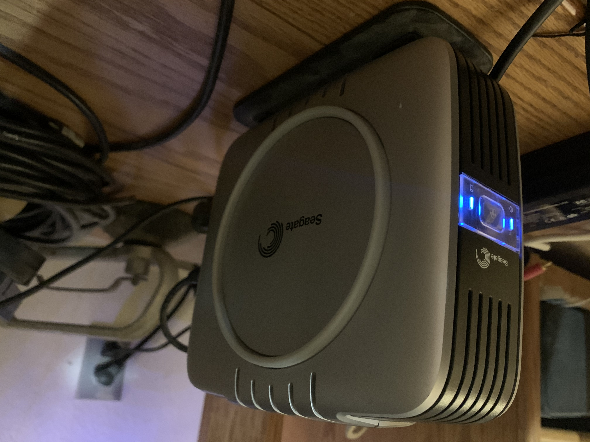

## Not ancient but just "old"

This Seagate external drive is not ancient, but it is old, with only 200 GB capacity. It has USB 2 / FireWire connections. No one uses FireWire connectors now, so I had to copy it from the USB port, which was slower than FireWire. Inside the enclosure is a Barracuda 7200 RPM hard disk drive that uses a parallel ATA interface, which on modern PCs has since been replaced with Serial ATA.

These Seagate drives used a power supply with a DIN connector instead of a mono plug (second revision used mono plugs). I was finally able to find the power supply in one of my storage crates. I had considered disassembling the enclosure to take the drive out, but finding that power supply made that move unnecessary. 

This drive brings memories back. It contained all of my files from the days when I was at UC Riverside, and the days after. I stopped using this drive in 2008-ish. The drive appeared to have some data that was corrupted, so it's not a moment too soon. I was able to get the majority of the data out of the Seagate to one of my WD My Book Duos. When I transitioned from PC Windows to a Mac in 2003, I had to use this drive to pull all of my Windows data. Later about a few years later, I bought a Maxtor One Touch 300 GB drive as a second drive and duplicated data to that drive (since at the time, I moved to a laptop) and then I put the Seagate external drive away.

Since then, Seagate bought Maxtor, and then moved to a slimmer design in the early 2010s. They have since oriented their external drives to space than speed, and the same price I paid for that drive would have bought a Backup Plus drive with 4-6 TB's of storage. Many people now opt for SSD if they want a high performance drive.