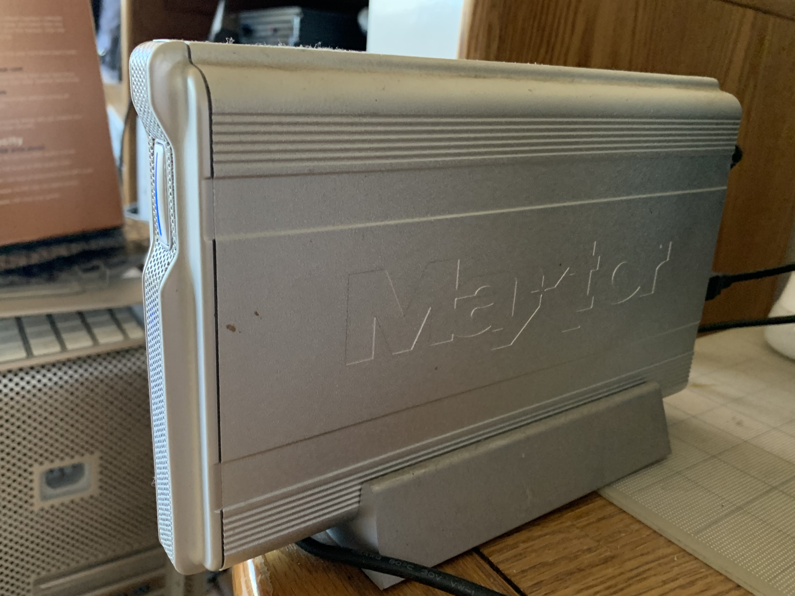

## Another not ancient but just "old" drive

Here is another drive that I also had to retire. It is a Maxtor OneTouch Backup, with 300 GB of capacity. It has USB 2 / FireWire (IEEE 1394) 400 and 800 connections. Obviously, no one uses either of the two FireWire connections now, so I had to copy it from the USB port, which was slower.

Seagate bought Maxtor in the meantime, and now all elements of Maxtor has vanished into the Seagate brand. 

The Maxtor drive brings more memories. Most files I had inside date to the late 2000s up to 2010. Had a lot of pictures dating back to the days when I was at Newsong Church (they had a Fullerton church campus as well as their Santa Ana one). I think I kept this drive as my main drive until I replaced it with a G-RAID Thunderbolt II. I migrated all data out of the Maxtor drive to the G-RAID, but never got around to retiring it, leaving it for dead. 

The G-RAID and the single-drive G-Drive models are made by G Technology, which uses HGST drives only. Western Digital bought G Technology, so G Technology effectively is a subsidiary of WD, and since then, they have upgraded the G-RAID to use a Thunderbolt 3 connection. I retired the enclosure and took its two drives to my new PC. 

I eventually decided to make use of my quarantine and get all of the data out of the OneTouch Backup drive to one of the My Book Duos. The Maxtor is going to be retired for good, this time.

## Is FireWire really dead?

FireWire is a dead interface in the USB 3 / Thunderbolt era. The interface is not as fast as USB 3 and even Thunderbolt ports.

FireWire, also known by IEEE 1394, was one of the first competing bus interfaces with Universal Serial Bus (USB). Apple was one of the main supporters of FireWire, equipping the ports on the majority of its Macs dating back to the original iMac, up to 2011.

Many people who used FireWire were involved predominantly in music and video production, and I even had an audio DAC converter that was powered with the FireWire interface (I stopped using it when I went to a Mac Pro 08, which already had a suitable sound chip). Numerous professional cameras and audio equipment used FireWire and USB interfaces before the dawn of USB 3 and Thunderbolt. 

Most newer pro-level cameras now use USB 3 and/or a Thunderbolt connection. I have a Panasonic G9 and it uses a USB 3.1 connection.

One of the reasons USB and FireWire are not compatible with each other (besides connectors) is that FireWire requires a higher voltage and current, while USB can make do with lower power, and that made it very tricky for interoperability. Not many motherboards contain FireWire ports, and those that do are not cheap. USB controllers often are situated inside a CPU or on a motherboard, which made USB acceptance a lot more prevalent.

I had used FireWire for a long while when I had my Macs up to the Mac Pro 08. For a time, Apple used FireWire connections for the early iPods, but eventually switched to the iPod 30-pin connector (the connector was also used on older iPhones before Lightning ports). iPhones used FireWire for a short time before they went to USB.

Apple moved to Thunderbolt ports starting in 2011, and gradually phased out FireWire ports from its Mac lineup. The MB Pro 13-inch (2012) was the last Mac to have FireWire ports, and was discontinued in 2016. 

