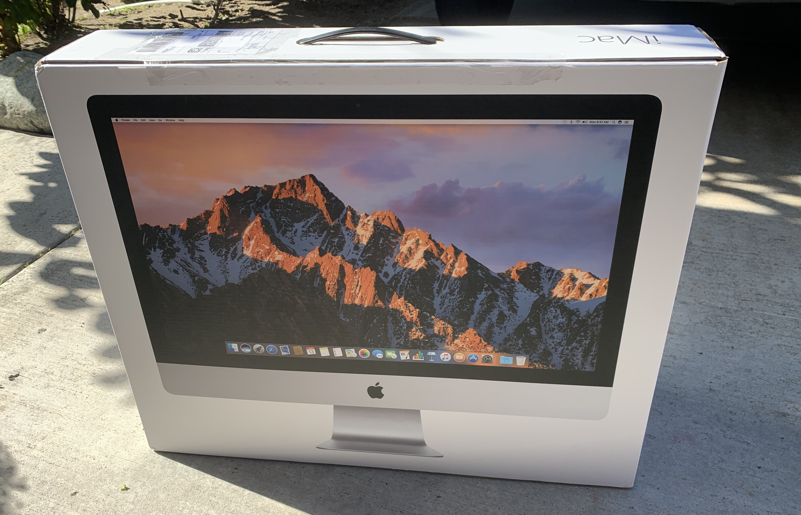

## The "almost" switch

On December 2019, I made a jump that I have almost never would have considered: to return to PC Windows in the desktop space. Although I had somewhat returned somewhat in 2017 when I got my iMac 27-inch and installed Windows 10 - Boot Camp on it, 2019 was the year where I finally jumped in.

Having had a MacBook Pro 13-inch already made the switch for the iMac easier. Plus I already had an LG 34UM95 ultrawide display that was collecting dust so I decided to reuse it. I eventually will have to replace it with a newer model that will promise 4K resolution and a faster refresh.

The return to Windows in desktop space is the first time I have had a Windows bonafide machine since 2002, when I left to Macs. The last Windows machine had Windows...2000, a Pentium III, a Diamond Multimedia NVIDIA RIVA TNT powered card, a hard drive with a whopping 1 TB of capacity(?), and a DVD-RW drive. I never upgraded it to XP at all.

## My new PC (pics soon)

- CPU - AMD Ryzen 3900X
- Logicboard - ASUS ROG Strix X570-E
- Hard drives - two 6 TB HGST's from my G-RAID Thunderbolt II enclosure
- SSDs - Samsung 970 EVO NVMe 1 TB and Samsung 830 EVO SATA 500 GB
- GPU - NVIDIA RTX 2070 Super (as EVGA 2070 XC)
- PC case - NZXT H510i 

